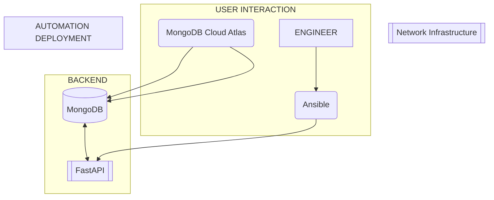

```mermaid
flowchart TB
    A[(MongoDB)]
    B[[FastAPI]]
    C(MongoDB Cloud Atlas)
    D(Ansible)
    E[[Network Infrastructure]]
    F[ENGINEER]
    subgraph BACKEND
        A <--> B
    end
    subgraph USER INTERACTION
        C --> A
        F --> D
    end
    subgraph AUTOMATION DEPLOYMENT
        C --> A
        D --> B
    end
```
