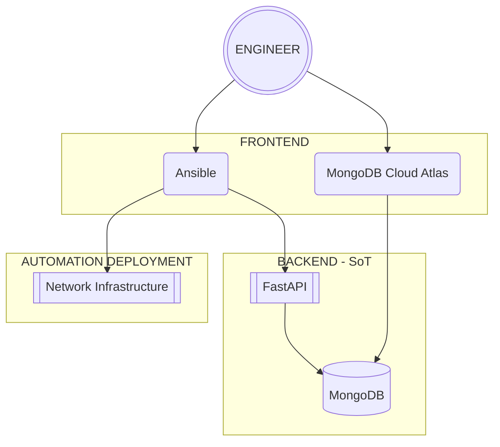

```mermaid
flowchart TB
    A[(MongoDB)]
    B[[FastAPI]]
    C(MongoDB Cloud Atlas)
    D(Ansible)
    E[[Network Infrastructure]]
    F(((ENGINEER)))
    subgraph BACKEND - SoT
        B --> A
    end
    subgraph FRONTEND
        C --> A
        D --> B
    end
    F --> C
    F --> D
    subgraph AUTOMATION DEPLOYMENT
        D --> E
    end
```
