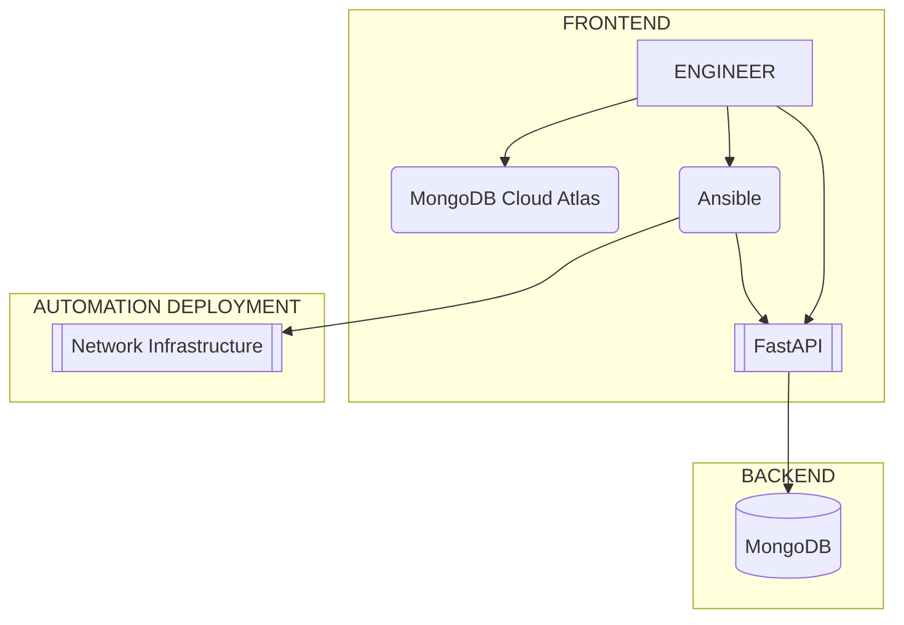

```mermaid
flowchart TB
    A[(MongoDB)]
    B[[FastAPI]]
    C(MongoDB Cloud Atlas)
    D(Ansible)
    E[[Network Infrastructure]]
    F[ENGINEER]
    subgraph FRONTEND
        F --> B
        F --> D
        F --> C
    end
    subgraph BACKEND
        B --> A
    end
    subgraph AUTOMATION DEPLOYMENT
        D --> B
        D --> E
    end
```
