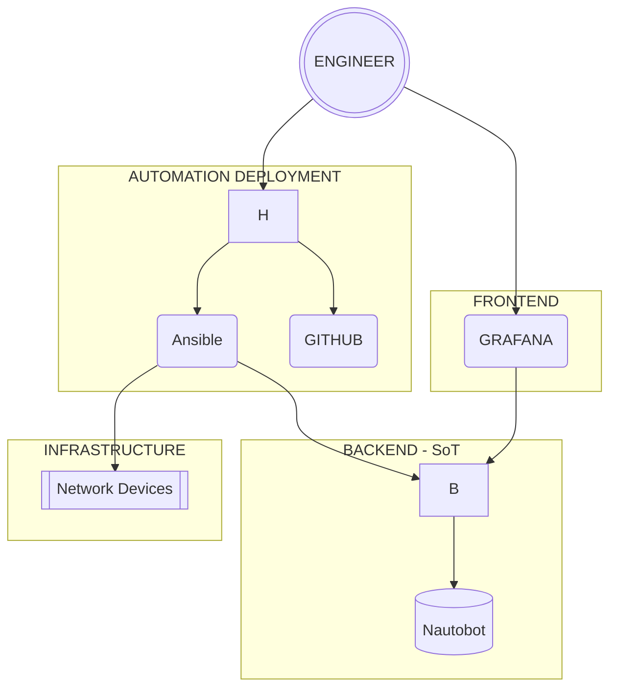

## Network Automation Platform

```mermaid
flowchart TB
    A[(Nautobot)]
    D(Ansible)
    E[[Network Devices]]
    F(((ENGINEER)))
    G(GRAFANA)
    I(GITHUB)
    subgraph BACKEND - SoT
        B --> A
    end
    subgraph FRONTEND
        G --> B
    end
    F --> H
    F --> G
    subgraph AUTOMATION DEPLOYMENT
        D --> B
        H --> I
        H --> D
    end
    subgraph INFRASTRUCTURE
        D --> E
    end
```
