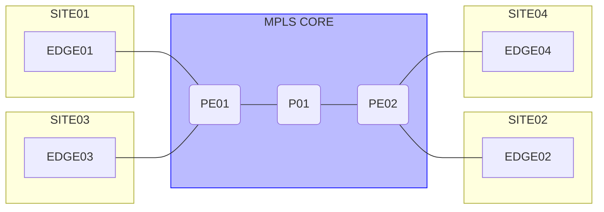

## Network Diagram (MPLS VPN network)

- IOSXE devices
- All devices connected to the same Management network
- Baseline (Hostname and MGMT address already applied to the devices)

```mermaid
flowchart LR
    subgraph SITE01
    A[EDGE01]
    end
    subgraph SITE03
    F[EDGE03]
    end
    A[EDGE01] --- B(PE01)
    F[EDGE03] --- B(PE01)
    subgraph CORE[MPLS CORE]
    B --- C(P01)
    C --- D(PE02)
    end
    D --- E[EDGE02]
    D --- G[EDGE04]
    subgraph SITE02
    E[EDGE02]
    end
    subgraph SITE04
    G[EDGE04]
    style CORE fill:#bbf,stroke:blue
    end
```
